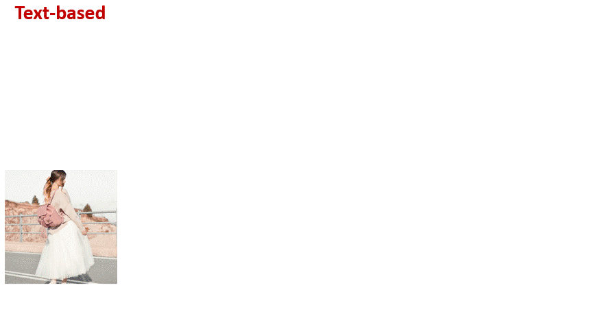
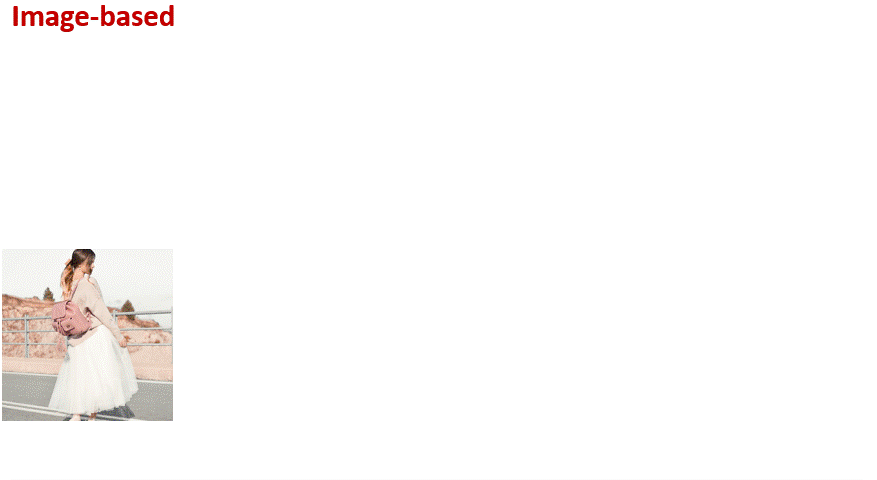
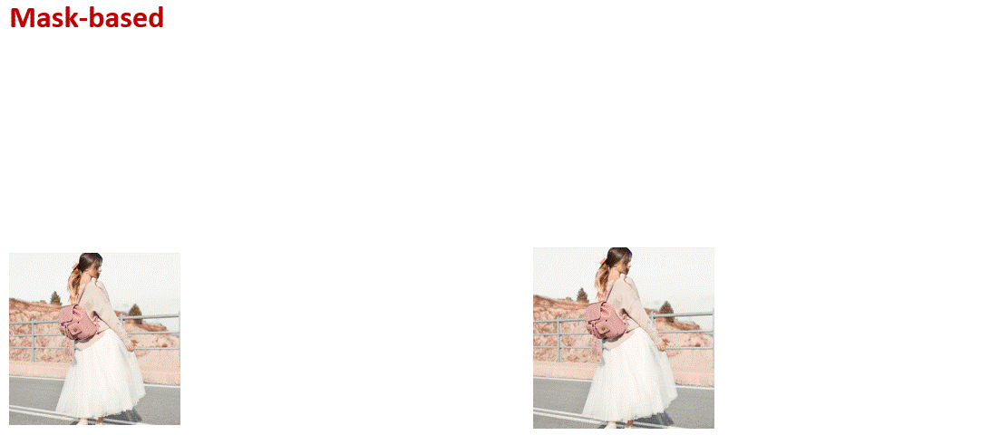

<div align="center">
<h1>An item is Worth a Prompt: Versatile Image Editing with Disentangled Control</h1>


<a href='https://arxiv.org/abs/2403.04880'></a>


</div>
D-Edit is a versatile image editing framework based on diffusion models, supporting text, image, mask, and optimization-guided editing. 

<!--  -->
## Release
- [2024/03/12] 🔥 Code uploaded.


## 🔥 Examples

<p align="center">
  
&nbsp; &nbsp; &nbsp; &nbsp;
  
</p>


<p align="center">
  
&nbsp; &nbsp; &nbsp; &nbsp; &nbsp;
  
</p>

## 🔧 Dependencies and Installation
- Python >= 3.8 (Recommend to use [Anaconda](https://www.anaconda.com/download/#linux) or [Miniconda](https://docs.conda.io/en/latest/miniconda.html))
- [PyTorch >= 2.1.0](https://pytorch.org/)
```bash
conda create --name dedit python=3.10
conda activate dedit
pip install -U pip

# Install requirements
pip install -r requirements.txt
```


## 💻 Run

### 1. Segmentation
Put the image (of any resolution) to be edited  into the folder with a specified name, and rename the image as "img.png" or "img.jpg". 
Then run the segmentation model
```
sh ./scripts/run_segment.sh
```
Alternatively, run [GroundedSAM](https://github.com/IDEA-Research/Grounded-Segment-Anything) to detect with text prompt
```
sh ./scripts/run_segmentSAM.sh
```

Optionally, if segmentation is not good, refine masks with GUI by locally running the mask editing web:
```
python ui_edit_mask.py
```
For image-based editing, repeat this step for both reference and target images.

### 2. Model Finetuning
Finetune UNet cross-attention layer of diffusion models by running 
```
sh ./scripts/sdxl/run_ft_sdxl_1024.sh
```
or finetune full UNet with lora
```
sh ./scripts/sdxl/run_ft_sdxl_1024_fulllora.sh
```
If image-based editing is needed, finetune the model with both reference and target images using

```
sh ./scripts/sdxl/run_ft_sdxl_1024_fulllora_2imgs.sh
```

### 3. Edit \!
#### 3.1 Reconstruction
To see if the original image can be constructed
```
sh ./scripts/sdxl/run_recon.sh
```
#### 3.1 Text-based
Replace the target item (tgt_index) with the item described by the text prompt (tgt_prompt)
```
sh ./scripts/sdxl/run_text.sh
```
#### 3.2 Image-based
Replace the target item (tgt_index) in the target image (tgt_name) with the item (src_index) in the reference image
```
sh ./scripts/sdxl/run_image.sh
```
#### 3.3 Mask-based
For target items (tgt_indices_list), resize it (resize_list), move it (delta_x, delta_y) or reshape it by manually editing the mask shape (using UI).

The resulting new masks (processed by a simple algorithm) can be visualized in './example1/move_resize/seg_move_resize.png', if it is not reasonable, edit using the UI.

```
sh ./scripts/sdxl/run_move_resize.sh
```
#### 3.4 Remove
Remove the target item (tgt_index), the remaining region will be reassigned to the nearby regions with a simple algorithm.
The resulting new masks (processed by a simple algorithm) can be visualized in './example1/remove/seg_removed.png', if it is not reasonable, edit using the UI.

```
sh ./scripts/sdxl/run_move_resize.sh
```

#### 3.4 General editing parameters
- We partition the image into three regions as shown below. Regions with the hard mask are frozen, regions with the active mask are generated with diffusion model, and regions with soft mask keep the original content in the first "strength*N" sampling steps.
<p align="center">
  
</p>

- During editing, if you use an edited segmentation that is different from finetuning, add --load_edited_mask; For mask-based and remove, if you edit the masks automatically processed by the algorithm as mentioned, add --load_edited_processed_mask.

### Cite
If you find D-Edit useful for your research and applications, please cite us using this BibTeX:

```bibtex
@article{feng2024dedit,
  title={An item is Worth a Prompt: Versatile Image Editing with Disentangled Control},
  author={Aosong Feng, Weikang Qiu, Jinbin Bai, Kaicheng Zhou, Zhen Dong, Xiao Zhang, Rex Ying, and Leandros Tassiulas},
  journal={arXiv preprint arXiv:2403.04880},
  year={2024}
}
```
